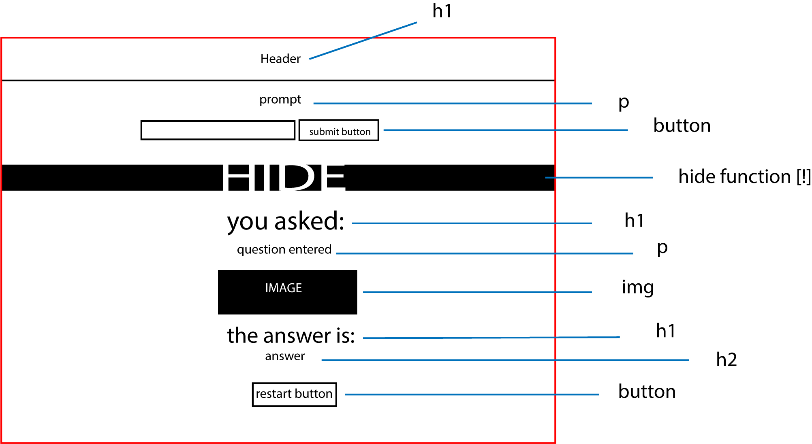

# FORTUNE TELLER

## PLAN
* HTML: list out sections and div's
* HTML: create class lists for hide toggle pointer
* HTML: create class and ID lists for styling
* HTML: set up static text elements
* JS: create and list variables in reference to HTML tags
* JS: create functional buttons
* JS: create hiding function
* JS: set question's display insert into HTML
* CSS: align text
* CSS: center button with flex container(?)
* add extra styling B)
